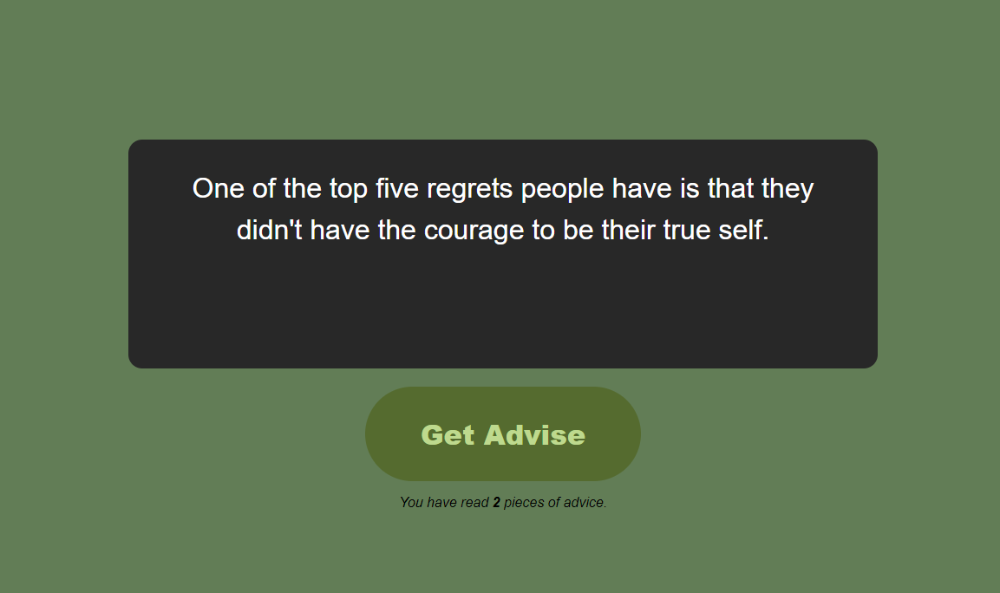

# Welcome to "Adviser" React App

This app is created along with the [The Ultimate React Course 2024](https://www.udemy.com/course/the-ultimate-react-course/ "Master modern React from beginner to advanced! Context API, React Query, Redux Toolkit, Tailwind, advanced patterns") course by [Jonas Schmedtmann](https://codingheroes.io/ "jonas.io"). Make sure to checkout his amazing contents.

This app displays a random advice fetched from [an API](https://adviceslip.com/ "adviceslip.com") on screen each time user pushes the `Get Advice` button. And also counts how many advices you've seen so far.

## Release Versions

The [version 1.0.0](https://github.com/ashkheid/today-i-learned/releases/tag/v1.0.0) is exactly what I had just after I finished the intro part of the course. In future I might update the code quality and add some features to this app.
